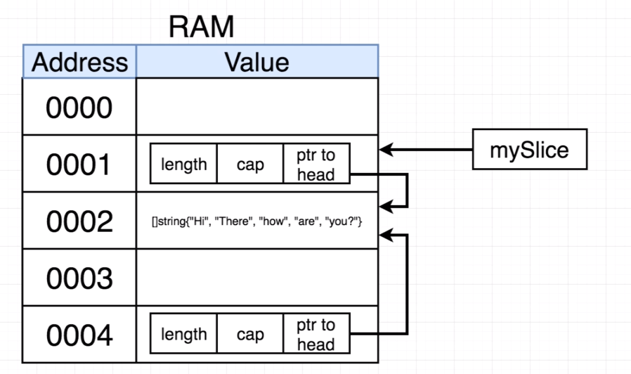

## Pass by Value or Pass by Reference

In Golang, by default everything is **Pass by value**. 

But, **some types have pointer as their value**. for example

slice value is combination of length, capacity, ptr to array in another location

Hence we are copying slice, it is copying the ptr, which point to same array.

So, type which have ptr as their value, behave as Pass by Reference always

## Pass By Value Types
Use Pointer to these types in function 
- int
- float
- string
- struct
- bool
- array
  
## Pass By Reference Types
Don't worry about pointer with these types
- slice
- map
- channel
- pointer
- function
